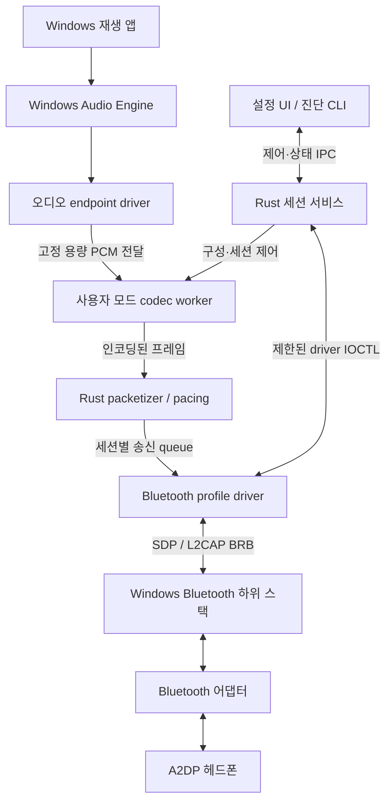
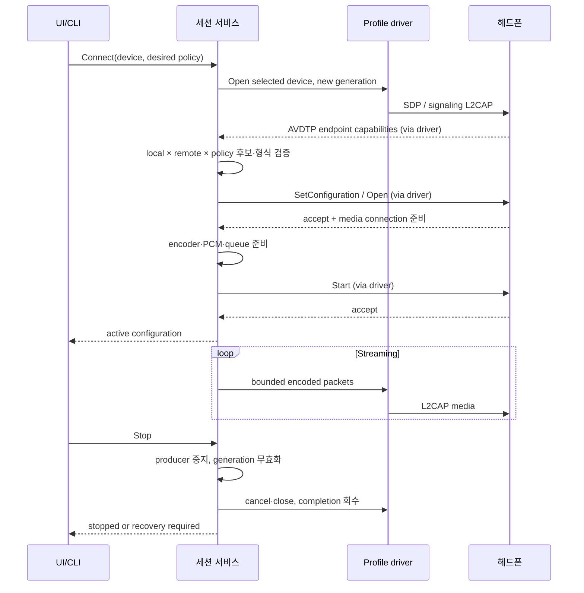

# 상세 아키텍처

상태: 초기 제안. 일반 Rust 로직과 Windows 경계를 분리하는 원칙은 결정했지만, 오디오 endpoint와 Bluetooth profile binding은 M1에서 증명해야 합니다.

## 시스템 경계

Microsoft 문서상 Bluetooth profile driver는 하위 스택의 L2CAP/SDP DDI를 사용할 수 있습니다. 이것은 사용자 모드 앱이 기존 A2DP 송신 코덱을 임의 교체할 수 있다는 의미가 아닙니다. [Microsoft profile driver 설명](https://learn.microsoft.com/en-us/windows-hardware/drivers/bluetooth/bluetooth-profile-drivers-overview)

도표는 **목표 구조**입니다. 현재 동작하는 오디오 경로를 나타내지 않습니다. 제어 plane과 PCM/media data plane은 별도 큐·상한을 가지며 UI의 호출이 오디오 callback을 막지 않아야 합니다.

## 모듈 책임과 구현 위치

| 모듈 (계획 경로) | 책임 | 하지 않는 일 |
| --- | --- | --- |
| `crates/a2dp-core` | codec 후보 정책, 검증된 값 타입, OS 독립 계약 | 장치 열거·실제 codec encode·커널 접근 |
| `crates/a2dp-protocol` | AVDTP parsing/state, codec payload, packetization | OS 장치 설치, UI 설정 영속화 |
| `crates/a2dp-codecs` | backend inventory, FFI encoder wrapper, format 검증 | 원격 장치가 지원하지 않는 codec 강제 |
| `crates/a2dp-service` | 한 장치 세션의 소유자, 제어, bounded pipeline, 진단 | 일반 UI에 원시 kernel handle 노출 |
| `crates/a2dp-cli` / UI | 조회·적용·복구 요청과 명확한 결과 표시 | 서비스 상태를 자체 추정해 활성 코덱으로 표시 |
| `drivers/audio` | render endpoint, PCM producer, PnP·전원 처리 | 임의 코덱 라이브러리의 커널 실행 |
| `drivers/bluetooth` | 장치별 SDP/L2CAP 요청, 취소·완료·전원 처리 | 사용자 입력 주소로 임의 Bluetooth peer 접속 |
| `installer` | 선정 장치 binding, 서명·버전 확인, 복구 | 전체 Bluetooth 스택 삭제·필터 주입 |

초기부터 빈 crate와 가짜 driver를 모두 생성하지 않습니다. 각 기능이 검증 가능한 단위가 될 때 디렉터리와 빌드를 추가합니다. 드라이버 workspace는 일반 Rust workspace와 분리하며 WDK·panic·linker 설정이 일반 코드에 전파되지 않게 합니다.

## 오디오 endpoint 선택

제안 1순위는 ACX/KMDF 기반 render endpoint입니다. ACX는 KMDF 위의 오디오 확장이며 WaveRT 스트리밍을 지원합니다. 다만 target WDK의 ACX API를 `windows-drivers-rs`가 바로 노출한다고 가정하지 않습니다. [ACX 설명](https://learn.microsoft.com/en-us/windows-hardware/drivers/audio/acx-audio-class-extensions-overview)

M1에서 필요한 bindings, PnP 모델, 가상 endpoint 적합성을 확인합니다. 충족하지 못하면 PortCls/WaveRT와 C/C++ 최소 bridge를 비교합니다. SYSVAD는 오디오 구조 참고 자료이며 그대로 Bluetooth 송신 드라이버가 되는 샘플은 아닙니다. [SYSVAD 설명](https://learn.microsoft.com/en-us/windows-hardware/drivers/audio/sample-audio-drivers)

첫 PCM format 제안은 48 kHz, stereo, signed 16-bit little-endian입니다. M2 이후 44.1 kHz와 다른 PCM 폭을 추가합니다. 이 값은 SBC의 모든 허용 형식을 뜻하지 않으며, output format이 encoder 입력과 다르면 명시적인 변환 단계가 필요합니다. 초기 버전에는 숨은 resampling을 넣지 않습니다.

## Bluetooth profile 소유권과 가장 큰 위험

**미확인:** 선택한 헤드폰의 A2DP 기능을 기본 드라이버와 충돌 없이 custom profile driver가 소유할 수 있는지, 해당 binding을 안정적으로 되돌릴 수 있는지.

M1은 다음 증거를 확보해야 합니다.

1. 대상 장치의 PnP instance와 기존 driver package·service·설정을 기록한다.
2. 대상 기능 노드에 한정된 설치 실험으로 profile driver가 적절한 하위 stack에 연결되는지 확인한다.
3. SDP로 Sink 서비스와 capability를 확인하고 signaling L2CAP channel을 연다.
4. 별도 media channel과 MTU, 채널별 disconnect/cancel completion을 확인한다.
5. 기본 드라이버가 같은 스트림을 동시에 소유하지 않음을 확인한다.
6. 제거·실패·재부팅 후 기본 오디오와 다른 Bluetooth 장치가 정상인지 비교한다.

사용자 모드에서 임의 raw L2CAP socket을 열 수 있다고 설계하지 않습니다. transport driver가 문서화된 BRB/DDI 경계를 맡습니다. L2CAP의 open 결과·MTU는 실제 협상 값을 사용합니다. [L2CAP client DDI](https://learn.microsoft.com/en-us/windows-hardware/drivers/bluetooth/creating-a-l2cap-client-connection-to-a-remote-device)

이 경로가 성립하지 않으면 UI·codec 확대를 멈추고 binding 설계를 재검토합니다. virtual audio endpoint만으로 기존 Windows A2DP 경로에 LDAC를 추가했다고 판단하지 않습니다.

## Rust와 native 경계

세션 정책·프로토콜·제어·진단은 Rust, kernel 경계는 Rust `no_std` 가능성을 검증합니다. `windows-drivers-rs`는 upstream이 아직 생산 환경 사용을 권장하지 않는 초기 프로젝트로 안내하므로, 버전 고정·별도 시험이 필요합니다. [upstream](https://github.com/microsoft/windows-drivers-rs)

- FFI wrapper만 `unsafe`를 허용하며 호출마다 buffer 길이·정렬·수명과 해제 주체를 기록한다.
- 외부 C codec은 사용자 모드 worker에서 먼저 통합한다. 메모리 할당·runtime 전제·라이선스를 커널에 억지로 맞추지 않는다.
- callback에서 blocking IPC, 파일 I/O, 동적 codec loading을 하지 않는다.
- kernel panic/unwind를 복구 수단으로 삼지 않는다. 취소·장치 제거와 IRQL별 실행 위치를 명시한다.
- Rust bindings 미지원이 확인되면 최소 native bridge를 ADR로 남기며 제품 전체의 Rust 방향을 자동 폐기하지 않는다.

## 데이터 흐름과 역압

PCM → encoder frame → codec별 media payload → transport packet 순서로 소유권을 이동합니다. 범용 packet header를 모든 vendor codec에 적용하지 않습니다. AVDTP signaling과 media framing의 형식·fragment 규칙은 각 사양과 golden packet으로 검증합니다.

초기 queue 제안은 PCM 최대 200 ms, media 최대 100 ms입니다. PCM 48 kHz × 2 channels × 2 bytes × 0.2 s = **38,400 bytes**이며, codec frame 및 buffer alignment를 반영해 할당 용량을 확정합니다. 이는 queue 메모리 예산이며 실제 end-to-end 지연이 아닙니다.

- 순번과 timestamp는 샘플 clock을 기준으로 계산하고 wall clock 변경에 영향받지 않는다.
- encoding은 완전한 PCM frame 단위로만 수행한다.
- downstream이 느리면 bounded queue에서 역압을 걸고, deadline을 넘으면 codec frame 경계에서 drop/재시작 정책을 실행한다.
- 임의 바이트를 잘라 전송하지 않는다. MTU가 작으면 해당 codec의 합법적인 aggregation/fragmentation 또는 명확한 실패를 선택한다.
- underflow는 계수하고 유한 시간 내 재개하지 못하면 suspend한다. 무한 silence 생성으로 실패를 감추지 않는다.
- 버퍼 초과·지연 급증에 대한 bit rate 조정은 codec별로 합법적이고 peer가 허용한 범위 안에서만 수행한다.

## 연결 흐름

순서의 모든 실패는 [인터페이스 계약](interfaces.md)의 cleanup 경로로 수렴합니다. peer 응답 없이 Start 성공을 가정하지 않습니다.

## 재연결·절전·기존 기능 공존

세션의 driver handles, encoder, queue는 하나의 session owner가 정리합니다. disconnect/suspend에서 generation을 무효화하고 I/O 완료를 회수한 뒤 메모리를 반환합니다. 절전 복귀는 새 capability 조회부터 시작합니다. 이전 sample rate·MTU를 재사용하지 않습니다.

HFP 마이크 사용은 Windows의 기존 profile 동작과 충돌할 수 있습니다. 초기 정책은 마이크 전환 시 프로젝트 스트림을 중단하고 상태를 알리는 것입니다. 동시 고음질 재생·마이크 지원을 약속하지 않으며 M4에서 기본 HFP 복구를 확인합니다.

서비스 crash 시 드라이버는 handle cleanup과 deadline으로 producer/consumer를 정지시켜야 합니다. 정상 서비스가 재시작되어도 이전 generation으로 미완료 전송을 되살리지 않습니다. 자동 복구가 실패하면 설치 상태를 임의 변경하지 않고 명시적인 복구가 필요한 상태로 보고합니다.
