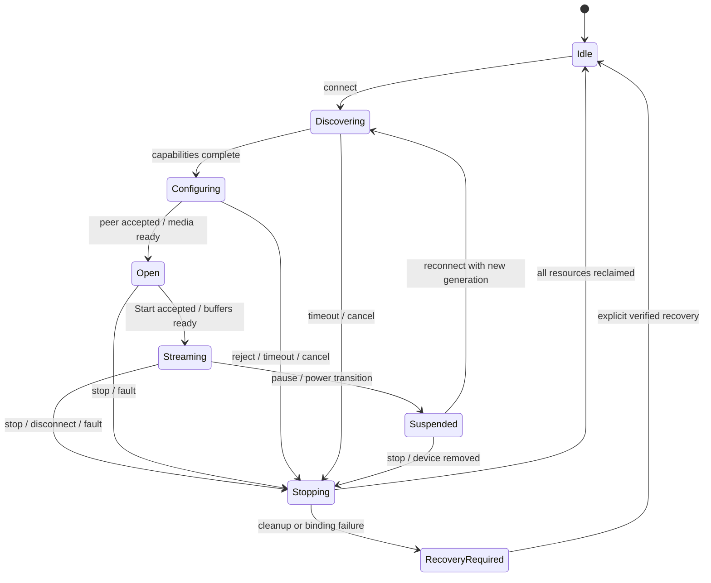

# 인터페이스·상태·오류 계약

상태: 설계 v0. **직렬화 ABI, IOCTL 숫자, GUID는 아직 배포 계약이 아닙니다.** OS 독립 모델과 실제 wire/driver 표현을 분리하고, 처음 구현할 때 golden vector와 version 검사를 함께 확정합니다.

## 코덱 후보와 실제 활성 상태

`Codec`의 계획 값은 SBC, AAC, LDAC, aptX, aptX HD, aptX Low Latency입니다. 이 enum에 존재한다는 사실은 backend 포함·지원 완료를 뜻하지 않습니다.

선택 정책 계약:

1. 호출자가 선호 codec 목록을 순서대로 제공한다. 빈 목록은 설정 오류다.
2. 검증된 local backend inventory와 **현재 세션**의 remote capability를 교차 확인한다.
3. 선호 목록의 첫 공통 codec을 후보로 반환한다.
4. 공통 항목이 없으면 사용자 정책이 명시적으로 `AllowSbc`일 때만 공통 SBC로 fallback한다.
5. 그 외에는 `NoCommonCodec`을 반환한다. 요청값을 몰래 다른 codec으로 저장하지 않는다.

이 순수 정책은 codec별 sample rate/bitrate/channel/latency parameter 협상보다 **앞선 후보 선정**입니다. 후보가 나와도 상세 형식이 맞지 않거나 peer가 거절할 수 있습니다. 다음 후보 시도는 전체 deadline 안에서 각 실패 이유를 보존하고 수행합니다.

| 필드 | 의미 |
| --- | --- |
| desired | 사용자가 저장한 선호와 품질 정책 |
| available | 탑재 backend·권리/빌드 정책·장치 capability상 제안 가능한 조합 |
| proposed | peer에 요청 중인 codec별 구체적인 설정 |
| active | peer accept와 스트림 시작이 확인된 설정, 중단 상태에서는 없음 |
| reason | fallback, 기능 미구현, peer reject, query 실패 등 구분된 이유 |

현재 workspace에는 encoder가 없으므로 backend inventory는 **비어 있음**이 기본입니다. [select_codec 구현](../crates/a2dp-core/src/codec.rs)은 호출자가 제공한 목록의 정책만 계산하며 discovery나 license 판단을 수행하지 않습니다. 샘플 데이터나 테스트 fixture의 codec 집합을 런타임 장치 조회 결과로 사용하지 않습니다. 권리 검토 완료와 backend runtime readiness는 별도 조건이며 코드 한 boolean으로 법적 승인까지 표현하지 않습니다.

## 세션과 상태 전이

session은 하나의 장치·한 스트림을 소유합니다. 요청마다 `request_id`, 연결마다 `session_id`와 단조 증가 `generation`을 붙입니다. OS 장치 경로·Bluetooth 주소는 공개 ID로 사용하지 않습니다.

이는 **서비스 수명주기 모델**이며 Bluetooth AVDTP의 SEP 상태 이름을 대체하지 않습니다. wire protocol state와 transaction label은 별도 parser/state machine에서 관리합니다. 타임아웃 뒤에도 진행 중인 BRB가 끝나기 전 메모리를 해제하면 안 됩니다.

| 사건 | 처리 계약 |
| --- | --- |
| 중복 Connect | 같은 request는 결과 재사용, 다른 장치/세션은 Busy 또는 명시적 전환 |
| Stop 재호출 | 멱등. 정리 중에는 같은 완료를 관찰; 두 번 해제하지 않음 |
| 늦은 callback | generation 불일치이면 상태 변경 없이 해당 요청의 자원만 회수 |
| 설정 변경 | 변경 가능 항목인지 확인; 필요한 경우 suspend → reconfigure 또는 재접속 |
| 장치 제거 | admission 중단, 새 generation, 모든 outstanding I/O 취소·회수 |
| 서비스 종료 | 제어 요청 중단, PCM 중단, media 중단, transport close, resource 회수 |
| 절전 복귀 | 기존 active 취소, 새로운 장치 상태·capability·MTU 확인 후 시작 |

오류 복구로 Idle에 돌아와도 last error는 진단 snapshot에 남깁니다. RecoveryRequired는 앱 재시작만으로 해제하지 않습니다.

## 제어 IPC 제안

UI/CLI ↔ 서비스는 **로컬 named pipe**, 서비스 ↔ driver는 장치 interface handle과 IOCTL을 제안합니다. 원격 네트워크 listener는 없습니다.

초기 제어 메시지는 4-byte little-endian payload 길이와 UTF-8 JSON입니다. 길이 상한 64 KiB, decode 깊이·문자열·배열 상한을 두고 부분 read/write를 처리합니다. 미지원 major version은 작업 실행 전에 거부합니다. 이는 앞으로 구현할 protocol이며 현재 listener가 없습니다.

공통 envelope 제안: `schema_version`, `request_id`, `command`, `device_id`, `generation`, `payload`. 응답은 같은 request ID, 관찰한 generation, success 또는 안정적인 error code를 포함합니다. mutating command의 stale generation은 재조회하도록 거부합니다.

| 명령 | 결과 | 권한·제약 |
| --- | --- | --- |
| ListDevices | 비식별 ID, 연결 상태, 조회 상태 | 조회만, 권한 없는 장치 경로 노출 금지 |
| GetCapabilities | local/remote codec별 제약, query generation, 설정 control의 지원 범위 | unknown과 empty를 구분, 미구현 control은 불가 이유 포함 |
| GetSession | desired/proposed/active, lifecycle, counters | snapshot 자체 generation 포함 |
| SavePolicy | desired 저장과 새 policy revision | expected revision 검사, 현재 스트림은 유지 |
| ApplyPolicy | 저장된 revision의 적용 결과 또는 재시작 필요 | generation·policy revision 검사, 저장 성공과 적용 성공 구분 |
| Connect / Stop | 최종 상태 또는 유한 deadline의 진행 ID | 사용자 세션·장치 접근 검사 |
| ExportDiagnostics | 비식별화 snapshot | 기본적으로 PCM·raw address·dump 제외 |

pipe ACL은 서비스 SID와 허용된 로컬 사용자만 접근시키고 remote client를 거부합니다. 다른 Windows 로그인 세션의 장치 제어 정책은 M2에서 명확히 정합니다. 인증한 pipe client를 기준으로 권한을 판단하며 JSON의 user 필드를 신뢰하지 않습니다.

UI의 저장하고 적용은 SavePolicy 성공 후 해당 revision으로 ApplyPolicy를 요청합니다. 저장 실패 시 ApplyPolicy를 보내지 않습니다. 저장 성공·적용 실패에서는 desired를 보존하고 실제 active 상태를 따로 보고합니다. 다른 client의 동시 수정은 revision 충돌로 거부하며, 상세 사용자 흐름은 [UI 설계](ui-design.md)를 따릅니다.

장치별 desired 설정의 계획 항목은 codec preference, sample rate mode/value, channel mode, bitrate mode/value, buffer profile, 명시적 SBC fallback, 장치 도착 시 자동 연결입니다. 미지원·읽기 전용·숨은 parameter를 저장 요청에 넣어 우회하지 못하도록 서비스가 재검증합니다. 자동 mode에서는 고정값이 활성 설정으로 해석되지 않아야 합니다.

capability의 설정 descriptor는 알려진 parameter ID, 허용 enum 또는 min/max/step, readonly, 적용 시 재연결 필요 여부, 불가 이유 code를 전달합니다. UI의 문구·control 종류는 승인된 ID와 연결하고 임의 markup을 렌더링하지 않습니다. 품질 프리셋은 서비스가 검증한 parameter 집합이며 수동 변경 후에는 custom 상태로 표시합니다. wire schema와 각 codec의 수치 범위는 backend 구현 시 확정합니다.

## Driver 제어·버퍼 계약 제안

초기 control은 `METHOD_BUFFERED`, 큰 PCM/media는 bounded direct I/O를 우선 시험합니다. `METHOD_NEITHER`와 user-supplied raw pointer를 v0 ABI에 넣지 않습니다. IOCTL read/write access, device interface ACL, 요청 최대 크기를 구현별로 명시합니다.

| 논리 연산 | 핵심 검증·결과 |
| --- | --- |
| QueryVersion | 구조체 size, ABI major/minor, 지원 feature bit |
| QueryDevice | handle에 binding된 peer만 조회 |
| OpenTransport | session generation, channel type, size·중복 open 검사 |
| SendSignaling / SendMedia | 길이 ≤ 협상 MTU 및 자체 상한, 채널 상태, deadline·queue credit |
| ReadPcm | format revision, frame count, buffer capacity; 완전한 frame만 전달 |
| CancelSession / Close | 멱등 취소, pending 요청 drain 완료와 결과 |
| ReadCounters | bounded 구조체 snapshot, 통계 reset generation |

driver ABI는 `u16/u32/u64` 등 고정 폭과 size/version 필드를 사용합니다. Rust enum의 native layout·`usize`·포인터를 그대로 직렬화하지 않습니다. header 이후 payload 길이를 checked arithmetic으로 계산하고 overrun·alignment를 검증합니다. kernel pointer, 임의 registry 경로, 임의 PSM/peer를 제어 API에 노출하지 않습니다.

PCM block 제안 필드: generation, format revision, 첫 sample index, frame count, byte length. frame는 한 시점의 모든 채널 sample을 포함합니다. bytes = frames × channels × bytes per sample이며 overflow·불완전 frame를 거부합니다. zero frame와 종료 신호를 혼용하지 않습니다.

미디어 block은 codec frame boundary, generation, sequence, sample timestamp, enqueue deadline, byte length를 갖습니다. encoder output buffer는 ownership이 transport로 넘어간 뒤 수정할 수 없습니다. 완료 또는 취소가 확인되어야 재사용합니다.

## 동시성·취소 책임

- 세션 제어는 단일 owner task에서 직렬화한다. PCM worker와 I/O completion은 bounded message로 사건을 전달한다.
- 각 pending driver request는 한 completion owner만 가진다. timeout은 cancellation 요청이며 완료를 의미하지 않는다.
- callback에서는 kernel이 허용한 IRQL과 문서화된 lock 순서를 따른다. 버퍼 해제와 FFI 호출은 적절한 worker context로 넘긴다.
- producer stop → 새 enqueue 금지 → cancel pending → completion 회수 → encoder·buffer·handle 해제 순서를 유지한다.
- service timeout이 지나면 사용자에게 실패를 알릴 수 있지만 kernel cleanup 책임은 계속 유지한다.

## 오류 분류·초기 재시도 정책

아래 숫자는 구현·실기에서 조정할 **제안값**이며 프로토콜 표준의 timeout을 대체하지 않습니다.

| 오류 | 사용자 표시 | 자동 재시도 |
| --- | --- | --- |
| InvalidPolicy / EmptyPreference | 설정 오류 | 없음 |
| BackendUnavailable | 이 빌드에 encoder 없음 | 없음 |
| CapabilityUnknown | 장치 능력 조회 실패 | 전송 일시 오류인 경우만 |
| NoCommonCodec / UnsupportedFormat | 공통 코덱/형식 없음 | 명시적 fallback 후보 외 없음 |
| PeerRejected | 거절 단계와 codec | 같은 설정 무한 반복 금지 |
| DeviceDisconnected / RadioUnavailable | 연결 또는 어댑터 없음 | 장치 도착 확인 후 1/2/4초 간격, 최대 3회 |
| TransportTimeout | signaling/media timeout | 전체 연결 예산 30초 내 제한; cancel completion 별도 회수 |
| QueueOverrun / Underrun | 끊김·drop 계수 | 정해진 frame 처리 후 suspend 또는 제한적 재시작 |
| VersionMismatch / AccessDenied | 업데이트 또는 권한 필요 | 없음 |
| DriverFault / RecoveryRequired | 복구 작업 필요 | binding·boot 설정 자동 변경 없음 |

사용자 Stop, 장치 removal, 서비스 종료는 재시도 예약도 취소합니다. 재시도 budget은 attempt마다 초기화하지 않습니다.

## 설정과 진단 보관

제안 위치는 machine 서비스 구성 `%ProgramData%\A2DP-for-Windows\`, UI 개인 선호 `%LocalAppData%\A2DP-for-Windows\`입니다. 실체가 만들어질 때 ACL·다중 사용자 소유권을 검증합니다. 비밀키는 설정 파일에 넣지 않습니다.

설정 변경은 schema 검증 → 임시 파일 write/flush → atomic replace 순서로 수행하며 손상 파일은 자동 적용하지 않습니다. persisted device key는 내부 mapping만 사용하고 export에서는 session별 임의 ID로 바꿉니다. stable hash도 추적 가능 식별자이므로 기본 공개 로그에 남기지 않습니다.

진단 최소 필드는 build, OS build, driver version, lifecycle transition, error stage/code, codec, sample rate, queue depth, encode time, packet/underrun/drop counts입니다. request ID와 generation으로 연결하고 원시 PCM·Bluetooth 주소·사용자 파일 경로는 수집하지 않습니다. 초기 rolling log 제안은 5 MiB × 3개이며, dump 수집·보관은 별도의 사용자 선택과 비공개 경로를 요구합니다.
