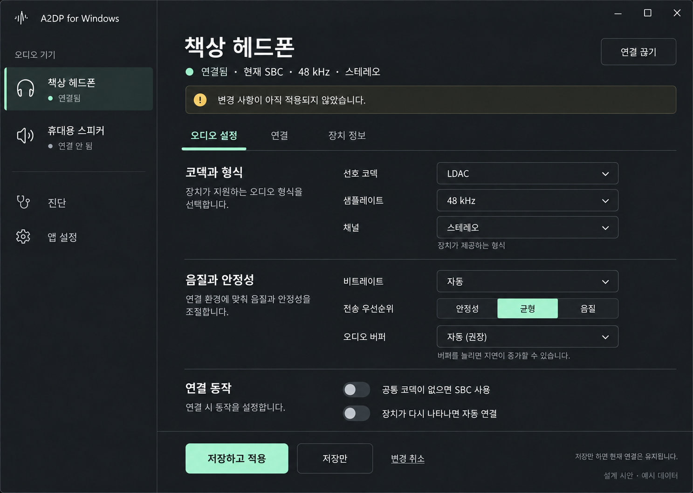
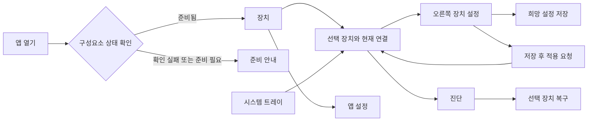

# UI 상세 설계

상태: **화면·상호작용 설계**, 앱 구현 전. Windows 11 데스크톱을 대상으로 독립 설계합니다. 기능 계약은 이 문서와 [인터페이스](interfaces.md)를 따릅니다. 시각 시안은 예시 데이터이며 장치 지원·실제 재생의 증거가 아닙니다.

확정 방향은 **어두운 좌우 분할 화면, 왼쪽 오디오 기기 선택, 오른쪽 선택 기기의 다양한 설정**입니다. 현재 적용 코덱은 상단 요약에 작게 유지하고, 오른쪽의 주 영역은 실제 설정 control에 사용합니다.

위 이미지는 선택한 시각 방향에 장치별 설정 요구를 반영한 기준 시안입니다. 현재 SBC와 미적용 LDAC는 저장/적용 구분을 보여주는 합성 사례입니다. 실제 encoder 지원을 의미하지 않습니다. [시안 생성 기록](ui/generation.md)에 제작 방식과 프롬프트를 기록했습니다.

## 1. 사용자가 바로 알아야 할 것

첫 화면에서 세 가지에 답합니다: **어느 장치에 연결하는가, 실제로 어떤 코덱을 쓰는가, 다음에 무엇을 할 수 있는가.** 기술 진단과 고급 옵션은 필요한 화면에서 펼칩니다.

- 주 사용자는 페어링한 헤드폰으로 Windows 소리를 듣고 코덱을 선택하려는 사람이다.
- 한 번에 한 장치·한 스트림만 활성화한다. 다른 장치를 클릭하는 행위만으로 재생을 전환하지 않는다.
- 요청한 설정과 현재 적용된 설정을 별도로 표시한다. 저장·적용 중·적용 완료를 같은 성공 알림으로 합치지 않는다.
- 지원 여부를 모르면 확인 중 또는 확인 실패로 표시한다. 미지원으로 단정하지 않는다.
- 처음 설치한 빌드에 재생 기능이 없으면 준비 상태를 표시하고 연결 버튼을 비활성화한다.

## 2. 화면 지도

기본 화면 왼쪽에는 **오디오 기기 목록**, 아래에는 **진단 · 앱 설정**을 둡니다. 장치를 선택하면 오른쪽에서 즉시 해당 장치의 설정을 편집합니다. 오른쪽 하위 탭은 **오디오 설정 · 연결 · 장치 정보**이며 선택 장치와 현재 적용 요약을 유지합니다. 연결 설정은 별도 창을 열어야 접근할 수 있는 기능으로 숨기지 않습니다.

| 화면 ID | 화면 | 중심 정보 | 주 동작 | 보조 동작 |
| --- | --- | --- | --- | --- |
| UI-01 | 준비 안내 | 서비스·오디오 구성요소의 준비 여부와 한 가지 해결 방법 | 다시 확인 | Windows Bluetooth 설정 열기 |
| UI-02 | 장치 | 왼쪽 기기 목록, 오른쪽 선택 장치와 실제 적용 요약 | 장치 선택 또는 연결 | 연결 끊기, 장치 새로 고침 |
| UI-03 | 오른쪽 장치 설정 | 코덱·형식·음질·버퍼·연결 동작·미적용 변경 | 저장하고 적용 | 저장만, 변경 취소 |
| UI-04 | 진단 | 선택 장치의 현재 문제, 마지막 확인 시각, 제한된 지표 | 오류에 맞는 복구 동작 | 진단 보고서 저장 |
| UI-05 | 앱 설정 | 테마, 창 닫기, 자동 실행, 접근성 관련 시스템 설정 안내 | 변경 항목별 즉시 저장 | 기본값 복원 |
| UI-06 | 장치 복구 | 대상 장치, 중단되는 연결, 수행 단계와 결과 | 복구 시작 | 실행 전 취소 |
| UI-07 | 트레이 메뉴 | 활성 장치와 연결 상태 | 앱 열기 | 연결 끊기, 앱 종료 |

## 3. 창 구조와 정보 위계

초기 기준 창은 1,040×760 DIP, 최소 720×640 DIP를 제안합니다. 1,440×1,024 시안은 화면 구성을 검토하기 위한 이미지 크기이며 실제 창 크기를 강제하지 않습니다.

| 영역 | 구조와 동작 |
| --- | --- |
| 제목 영역 | `A2DP for Windows`, 표준 최소화·최대화·닫기. 드래그 영역이 버튼과 겹치지 않음 |
| 왼쪽 기기 영역 | 기본 240 DIP, 화면 폭에 따라 220~280 DIP. 오디오 기기 목록과 진단·앱 설정 탐색 |
| 장치 선택 | 이름·아이콘·상태를 한 행에 표현. 한 장치 선택, keyboard arrow 이동 지원. 선택하면 오른쪽의 장치별 draft 표시 |
| 오른쪽 주 콘텐츠 | 장치 이름·작은 적용 상태 요약 → 하위 탭 → 설정 그룹 → 저장·적용 action 순서. 창의 나머지 폭 사용 |
| 지속 상태 | 서비스 연결 상실·복구 필요는 지워지는 toast 대신 해당 화면 상단에 유지 |
| 설정 편집 | 코덱과 형식 / 음질과 안정성 / 연결 동작을 구분. 오른쪽 하단에 저장·적용 action 유지, 본문만 스크롤 |

폭이 부족하면 장치 목록과 상세를 한 열의 목록 → 상세 흐름으로 바꿉니다. 현재 연결 요약을 유지하며 선택 장치로 돌아갈 경로를 제공합니다. 200% 텍스트 확대에서도 주요 동작이 가려지지 않도록 콘텐츠를 수직 스크롤하고 버튼 행을 재배치합니다.

시각 체계는 의미 기반 token으로 관리합니다: `surface`, `text-primary`, `text-secondary`, `accent`, `success`, `warning`, `error`, `focus`. 기본 시안은 charcoal 배경, 밝은 본문, 낮은 채도의 mint 강조를 사용합니다. 숫자·색상만으로 상태를 구분하지 않습니다. 일반 본문 14~16 DIP, 화면 제목 24~28 DIP, 4/8 DIP 간격 단위를 제안합니다. 한 화면의 강조 동작은 저장하고 적용이며, 항목마다 별도 카드와 그림자를 추가하지 않습니다. 시스템 밝은 theme·고대비에서는 semantic token으로 대체합니다.

## 4. UI-01 준비 안내

앱 진입 시 서비스 연결, API version, driver 준비 상태를 조회합니다. 조회 중에는 장치 목록을 실제 결과처럼 채우지 않습니다.

| 상태 | 문안 | 사용 가능한 동작 |
| --- | --- | --- |
| 조회 중 | 연결 준비 상태를 확인하고 있습니다. | 제한된 대기 후 취소 또는 다시 확인 |
| 서비스 미실행 | 연결 서비스를 사용할 수 없습니다. | 다시 확인, 해결 방법 보기 |
| 호환 version 불일치 | 앱과 연결 구성요소의 버전이 맞지 않습니다. | 설치된 버전 보기, 닫기 |
| encoder 미포함 | 이 빌드에는 오디오 전송 기능이 준비되지 않았습니다. | 문서 보기, 진단 정보 보기 |
| radio 없음/꺼짐 | 사용할 수 있는 Bluetooth 어댑터가 없습니다. | Windows Bluetooth 설정 열기, 다시 확인 |
| 준비 완료 | 상태 안내 종료, 실제 장치 목록으로 이동 | 장치 선택 |

오디오 구성요소 설치가 구현·검증되기 전에는 가짜 설치·복구 버튼을 제공하지 않습니다. 테스트 서명이나 부팅 보안 변경을 일반 사용자 화면의 자동 해결책으로 넣지 않습니다.

## 5. UI-02 장치와 현재 연결

첫 방문에서는 최근에 사용한 장치를 선택만 합니다. 자동 연결은 기본으로 꺼져 있으며 사용자가 별도로 켠 경우에만 실행합니다. 다른 장치가 이미 활성화되어 있으면 상단에 활성 장치 요약을 보존합니다.

장치 행은 공개 alias 또는 사용자가 알아볼 수 있는 장치 이름, 상태, 지원 확인 결과만 표시합니다. Bluetooth 주소·일련번호는 표시하지 않습니다. 배터리와 신호 세기는 신뢰할 수 있는 실제 측정 API가 구현되기 전에는 표시하지 않습니다.

| 장치 목록 상태 | 화면 처리 |
| --- | --- |
| 아직 페어링한 장치 없음 | 빈 상태 문안과 Windows Bluetooth 설정 열기 |
| 목록 불러오기 실패 | 오류 문안과 다시 시도. 빈 목록으로 교체하지 않음 |
| 장치 있음, capability 확인 중 | 연결 비활성 + 지원 확인 중 |
| 조회 성공, 공통 codec 없음 | 연결 비활성 + 사용할 수 있는 공통 코덱 없음 |
| 준비 완료 | 사용자가 선택한 정책으로 연결 가능 |
| 장치가 사라짐 | 해당 상태 표시, 최신 장치 목록 유지, 반복 연결 금지 |

선택 장치 화면의 실제 적용값은 `active` snapshot을 사용합니다. `active`가 없으면 `연결 후 표시` 또는 현재 상태에 맞는 문구를 표시합니다. SBC, 샘플레이트, 성공 배지는 기본값으로 미리 채우지 않습니다.

다른 장치가 활성일 때는 **이 장치로 전환**을 표시합니다. 클릭하면 “현재 장치의 오디오가 중단되고 선택한 장치에 연결됩니다”라는 대상 이름이 포함된 확인을 제공합니다. 승인 후 Stop 완료를 확인하고 새 Connect를 보냅니다. 취소하면 기존 연결과 설정을 유지합니다.

## 6. 세션 상태와 UI 대응

아래 상태는 [서비스 수명주기](interfaces.md)의 관찰 결과로 결정합니다. 화면의 spinner나 animation 종료가 실제 상태를 바꾸지 않습니다.

| 서비스 상태/상황 | UI 문안 | 중심 동작 | 설정 편집·주의점 |
| --- | --- | --- | --- |
| Idle | 연결 안 됨 | 연결 | capability가 완료된 항목만 편집 |
| Discovering | 장치 지원을 확인하고 있습니다 | 취소 | 중복 Connect 금지 |
| Configuring | 연결 설정을 적용하고 있습니다 | 취소 | proposed 표시, active로 승격 금지 |
| Open | 오디오 연결을 준비하고 있습니다 | 취소 | peer Start 확인 전 전송 중 표시 금지 |
| Streaming | 오디오 전송 중 | 연결 설정 | 실제 codec·format 표시, 연결 끊기 제공 |
| Suspended | 오디오 전송 일시 중지 | 연결 상태 다시 확인 | 이전 값을 현재 active로 표시하지 않음 |
| Stopping | 연결을 종료하고 있습니다 | 진행 상태 보기 | 중복 Stop은 같은 요청 상태를 관찰 |
| RecoveryRequired | 연결을 복구해야 합니다 | 복구 방법 보기 | 무한 자동 재연결 금지 |
| 서비스 연결 상실 | 현재 연결 상태를 확인할 수 없습니다 | 다시 확인 | 마지막 확인값을 과거값으로 명시, 제어 비활성 |
| 설정 저장 성공·적용 실패 | 설정은 저장했지만 연결에 적용하지 못했습니다 | 다시 적용 또는 연결 설정 | desired와 active를 구분 |

연결 중에는 진행 단계 이름을 보여주며 근거 없는 진행률을 만들지 않습니다. retry budget과 deadline은 서비스가 관리합니다. UI가 별도 timer로 새로운 Connect를 무한 생성하지 않습니다.

## 7. UI-03 오른쪽 장치 설정

오른쪽 기본 화면에서 코덱과 형식, 음질과 안정성, 연결 동작을 함께 편집합니다. 왼쪽에서 선택한 장치에만 적용되며, 다른 장치의 설정을 공통 기본값으로 덮어쓰지 않습니다. 현재 적용값은 상단에 작게 유지하고 큰 codec 이름만으로 본문을 채우지 않습니다.

### 설정 control 목록

| 그룹 | 항목 | control | 활성 조건·의미 |
| --- | --- | --- | --- |
| 코덱과 형식 | 선호 코덱 | dropdown | 공통 지원과 이 빌드의 활성 backend가 확인된 후보. 미지원 이유는 목록 안에 표시 |
| 코덱과 형식 | 샘플레이트 | dropdown | `자동`과 codec·peer·PCM 경로가 함께 지원하는 값. 임의 resampling을 약속하지 않음 |
| 코덱과 형식 | 채널 | dropdown 또는 읽기 전용 | stereo 하나만 가능하면 고정값과 이유 표시. codec별 실제 허용값만 사용 |
| 음질과 안정성 | 비트레이트 | 자동/고정 dropdown + 지원값 선택 | 선택 codec의 bitrate control이 구현된 경우만. 자동은 backend가 적응 동작을 지원할 때만 제공 |
| 음질과 안정성 | 품질 프리셋 | 안정성 / 균형 / 음질 segmented control | backend가 정의한 검증된 설정 묶음. 임의로 codec 순서를 바꾸거나 지연·음질을 보장하지 않음 |
| 음질과 안정성 | 오디오 버퍼 | 자동(권장) / 지원 profile dropdown | pipeline이 제공하는 범위 안에서만 선택. 값을 늘릴 때 지연 증가 가능성 안내 |
| 연결 동작 | 공통 코덱이 없으면 SBC 사용 | toggle | 기본 꺼짐. SBC를 이미 선택했으면 비활성화하고 이유 표시 |
| 연결 동작 | 장치가 다시 나타나면 자동 연결 | toggle | 기본 꺼짐. 해당 장치에 한정, 사용자 Stop·앱 종료가 현재 재시도 예약보다 우선 |
| 고급 설정 | codec 전용 parameter | 펼침 영역의 검증된 control | 예: SBC bitpool. 해당 encoder와 peer 범위가 확인된 경우에만 노출 |

프리셋은 유효한 parameter 묶음을 draft에 적용하는 편의 기능입니다. 수동으로 구성값을 바꾸면 **사용자 설정**으로 표시하며 프리셋 이름과 실제 값이 서로 어긋나지 않게 합니다. `자동` mode가 선택되면 고정값 control은 비활성화하고 이전 수동 입력은 mode가 다시 바뀔 때만 복원합니다.

bitrate·buffer의 고정 숫자 목록을 모든 codec과 장치에 공통 적용하지 않습니다. 서비스 capability가 허용값, min/max/step, readonly 여부, 재연결 필요 여부를 전달해야 합니다. backend가 준비되지 않은 기능은 **이 빌드에서 준비 중**으로 구분하고 작동하는 것처럼 slider를 제공하지 않습니다.

`연결` 탭은 재연결 설정과 현재 오류의 다음 행동, `장치 정보` 탭은 읽기 전용 장치 지원 형식·앱/driver version·현재 적용 상세를 다룹니다. 앱 전체 테마·자동 실행은 왼쪽 **앱 설정**에 둡니다. 장치의 ANC·마이크·EQ 등 별도 제어 프로토콜이 필요한 항목은 이 설정 화면에 추가하지 않습니다.

### 코덱 가용성

지원 후보 전체 목록은 정보를 제공하되 미구현 항목은 선택 불가 이유를 곁에 표시합니다.

| codec 행 상태 | 표시 | 선택 가능 |
| --- | --- | --- |
| local·remote·정책 검증 완료 | 사용 가능 | 가능 |
| local backend 미포함 | 이 빌드에서 준비 중 | 불가 |
| capability 조회 미완료 | 장치 지원 확인 중 | 불가 |
| 조회 성공, remote 미지원 | 이 장치에서 지원하지 않음 | 불가 |
| 상세 format 교집합 없음 | 공통 오디오 형식 없음 | 불가 |
| 배포 정책에 따른 비활성 | 이 빌드에서 제공되지 않음 | 불가, 권리 계약 상세는 개발 문서에서 관리 |

미지원 이유는 hover tooltip에만 숨기지 않고 행 설명과 접근성 description에 포함합니다. 선호 codec이 SBC이면 SBC 대체 option은 중복 의미가 생기므로 숨기거나 “이미 SBC를 선택했습니다”로 비활성화합니다.

SBC 대체는 선호 codec 교집합이 없을 때만 후보 정책에 사용합니다. radio 끊김·권한 오류·driver 오류·encoder crash를 SBC로 재시도하는 일반 복구 스위치가 아닙니다. 기본값은 꺼짐입니다.

### 설정 저장과 적용의 일관성

UI의 장치별 `draft`는 저장된 `desired`와 별도로 유지합니다. 현재 출력은 `active`로만 표시합니다. 장치 선택을 바꿀 때 저장하지 않은 변경이 있으면 계속 편집 / 변경 버리기를 먼저 확인하며, 확인되지 않은 draft를 다음 장치에 복사하지 않습니다.

| 동작 | 계약 |
| --- | --- |
| codec·형식 변경 | draft만 변경. 장치 통신·재연결·disk write는 아직 하지 않음 |
| 취소 | draft 폐기, 기존 desired·active 보존 |
| 저장만 | version 검증 후 desired 저장. 현재 스트림은 유지 |
| 저장하고 적용 | desired 저장 성공 후 명시적 ApplyPolicy. 재연결 필요 시 오디오 중단 안내 |
| 저장 실패 | desired·active를 유지하고 form 안에 오류 표시. 적용 요청은 보내지 않음 |
| 저장 성공·적용 실패 | 저장 여부와 현재 출력을 각각 표시. 실패를 저장 rollback으로 숨기지 않음 |
| capability/generation 변경 | draft는 보존하고 적용 비활성, 새 정보와 차이를 확인하게 함 |

변경 내용을 저장하지 않고 화면을 나가면 **계속 편집 / 변경 버리기**를 제공합니다. 설정 차이가 없으면 확인을 띄우지 않습니다. 저장만 수행한 뒤에는 “다음 연결부터 사용” 상태를 표시합니다.

codec 변경에 재연결이 필요하면 대상 장치, 기존 codec → 요청 codec, 오디오 중단 가능성을 실행 전에 보여줍니다. 적용 성공 toast는 peer accept와 서비스 snapshot 갱신이 모두 확인된 뒤 짧게 표시하고, 실제 출력값은 화면에 계속 남깁니다.

## 8. UI-04 진단과 UI-06 복구

일반 사용자 화면은 **현재 문제 → 할 수 있는 다음 행동** 순서입니다. 기술 지표는 상세 연결 정보에서 펼칩니다. 값이 없으면 `확인할 수 없음`, 측정 중이면 `측정 중`으로 표시하며 0으로 대체하지 않습니다.

| 문제 | 문안 예시 | 다음 행동 |
| --- | --- | --- |
| capability 조회 실패 | 장치의 지원 코덱을 확인하지 못했습니다. | 다시 확인 |
| 공통 codec 없음 | 이 장치와 사용할 수 있는 코덱이 없습니다. | 연결 설정 보기 |
| 설정 거절 | 장치가 이 연결 설정을 받아들이지 않았습니다. | 설정 바꾸기 |
| 연결 단절 | 장치와 연결이 끊어졌습니다. | 서비스가 허용하는 경우 다시 연결 |
| 반복 timeout | 정해진 시간 안에 연결을 완료하지 못했습니다. | 장치·Bluetooth 상태 확인, 진단 보고서 저장 |
| driver 복구 필요 | 오디오 연결을 복구해야 합니다. | 선택 장치 복구 안내 |

진단 보고서는 사용자가 내용을 미리 보고 **로컬 파일로 저장**하도록 합니다. 자동 업로드를 하지 않습니다. build·OS version·codec·상태 전이·비식별 오류만 기본 포함하고 원시 오디오, 장치 주소, 일련번호, dump는 포함하지 않습니다.

복구 화면에는 선택 장치의 현재 연결 중단, 기본 Windows 오디오로 돌아가는 영향, 관리자 권한이 필요한 시점을 먼저 표시합니다. 실제 구현된 복구 경로만 실행합니다. 복구 시작 전에는 취소 가능하고, 수행 중에는 현재 단계·완료 여부를 사실대로 보여줍니다. 기본 driver binding과 재생 확인 전에는 “복구 완료”를 표시하지 않습니다.

## 9. UI-05 앱 설정과 UI-07 트레이

초기 설정은 **시스템 테마 사용, Windows 시작 시 자동 실행 꺼짐, 장치 자동 연결 꺼짐**입니다. 지원하지 않는 기능은 준비 중으로 장식하지 않고 설정에서 제외합니다.

닫기 버튼은 창만 닫고 현재 연결을 유지하는 동작으로 설계합니다. 첫 실행의 간단한 안내와 설정에서 이 동작을 설명하며 트레이에서 앱을 다시 열 수 있게 합니다. **앱 종료**는 연결 중이면 중단 여부를 확인하고 Stop 완료 후 UI를 종료합니다. 서비스는 OS 구성요소로 대기할 수 있지만 명시적 종료 후에는 자동 재연결을 예약하지 않습니다.

트레이 메뉴는 상태 요약, 앱 열기, 연결 끊기, 앱 종료만 제공합니다. codec의 고급 변경과 driver 복구는 전체 화면에서 수행합니다. 아이콘 색만으로 연결·오류를 표현하지 않고 tooltip·접근성 이름에 현재 상태를 포함합니다.

## 10. UI와 서비스 연결 계약

UI는 무권한 클라이언트이며 local IPC로만 요청합니다. driver handle·주소·관리자 명령을 직접 다루지 않습니다. device alias → 내부 ID의 변환과 권한 검사는 서비스가 담당합니다.

| 사용자 행동 | 서비스 명령/데이터 | UI 불변식 |
| --- | --- | --- |
| 장치 열기/갱신 | ListDevices, GetCapabilities | 조회 실패를 빈 결과로 간주하지 않음 |
| 연결 상태 보기 | GetSession | 한 snapshot의 generation·active·reason을 함께 사용 |
| 희망 설정 저장 | SavePolicy, expected policy revision | 동시 수정 시 덮어쓰지 않고 재조회 |
| 저장된 설정 적용 | ApplyPolicy, saved policy revision, generation | 저장 성공 여부와 적용 성공 여부 구분 |
| 연결/끊기 | Connect / Stop + request ID | 단일 명령 진행 상태, 중복 클릭 멱등 처리 |
| 진단 저장 | ExportDiagnostics | 비식별화 결과 preview 후 사용자 경로 저장 |

UI 입력 검증과 별도로 서비스가 같은 값·version·권한을 다시 검증합니다. 결과에는 request ID와 generation을 포함합니다. 이전 장치의 늦은 응답으로 현재 상세 화면을 덮어쓰지 않습니다. event stream 도입 전에는 화면이 보일 때 1초 간격 상태 조회를 제안하며 직전 조회가 끝나지 않으면 겹쳐 보내지 않습니다. 실제 주기는 부하·전원 시험으로 조정합니다.

서비스별 상태 모델과 접근성 tree를 분리한 presentation layer를 둡니다. framework 선택은 native window·UI Automation·DPI·트레이·배포 크기·Rust IPC 검증 결과로 확정하며, 시각 시안이 driver 구조나 runtime을 결정하지 않습니다.

## 11. 키보드·접근성·DPI

- Tab 순서: 탐색 → 장치 선택 → 주 콘텐츠 control → 주 동작 → 보조 동작. List/RadioGroup 내부는 방향키, 활성화는 Enter/Space를 사용한다.
- Escape는 현재 dialog·편집 취소만 담당한다. 재생을 바로 중단하는 단축키로 사용하지 않는다.
- `Ctrl+,`는 앱 설정, `F5`는 현재 조회 갱신으로 제안한다. 비활성 동작을 단축키로 우회하지 못하게 한다.
- 모든 control에 이름·role·value·disabled reason을 노출한다. async 상태가 바뀌어도 키보드 focus를 임의 이동하지 않는다.
- 상태 오류는 text와 icon을 함께 사용한다. 중요 오류는 polite/live 알림과 지속 문안으로 전달하며 매초 통계 변화는 읽어주지 않는다.
- 일반 텍스트 대비 4.5:1 이상, 큰 텍스트 3:1 이상을 목표로 검증한다. Windows 고대비 theme, 텍스트 200%, DPI 100/125/150/200%를 확인한다.
- 주요 click target은 40 DIP 이상을 제안한다. window resize와 긴 장치 이름에서 버튼이 겹치거나 잘리지 않게 한다.
- 장치 이름은 plain text로 처리하고 최대 표시 길이를 제한한다. 전문은 접근성 description과 명시적인 상세 보기에서 읽을 수 있게 한다.
- 움직임 감소 설정을 따르고 spinner 외의 장식 animation은 넣지 않는다. 연결 성공을 animation만으로 전달하지 않는다.

공식 기준: [Windows 접근성](https://learn.microsoft.com/en-us/windows/apps/develop/accessibility), [접근성 점검](https://learn.microsoft.com/en-us/windows/apps/design/accessibility/accessibility-checklist), [키보드 상호작용](https://learn.microsoft.com/en-us/windows/apps/develop/input/keyboard-interactions).

## 12. UI 수용 기준

| 검증 ID | 시나리오 | 기대 결과 |
| --- | --- | --- |
| UX-01 | 첫 실행, encoder 없음 | 상태 안내, 연결 불가 이유, 활성 codec 표시 없음 |
| UX-02 | 장치 없음 vs 목록 조회 실패 | 다른 문안·다음 행동, 실패 시 기존 목록 보존 |
| UX-03 | 선택 장치 변경 중 다른 장치 재생 | 보기만 전환, 실제 재생은 명시적 전환 전까지 유지 |
| UX-04 | 지원 미확인·미지원 codec | 원인을 읽을 수 있고 선택·단축키 적용 모두 불가 |
| UX-05 | 희망 LDAC, 허용된 SBC 사용 | 요청값과 실제 SBC 및 이유가 동시에 보임 |
| UX-06 | 저장 성공, 적용 실패 | 저장 사실과 이전/중단된 active 상태를 각각 표시 |
| UX-07 | 적용 중 장치 제거·stale 응답 | 과거 응답 무시, 새 상태 표시, 버튼 무한 잠금 없음 |
| UX-08 | 연결 중 Stop·창 닫기·종료 | 각각 정의된 동작, 중복 요청·자동 재연결 재생성 없음 |
| UX-09 | keyboard/Narrator만으로 연결 설정 | 모든 핵심 동작과 불가 이유 접근 가능 |
| UX-10 | 작은 창·고대비·200% text | 주요 버튼, 상태, 오류 문안 가림 없음 |
| UX-11 | 진단 내보내기 취소/성공 | 취소 시 전송 없음, 성공 시 사용자가 고른 로컬 파일만 생성 |
| UX-12 | driver 복구 실패 | 성공 문구 없음, 해당 단계와 다음 행동 유지 |
| UX-13 | 왼쪽 기기 선택, 오른쪽 설정 변경 | 선택한 장치의 control·draft·현재값만 갱신, 다른 장치 설정 보존 |
| UX-14 | codec 전환·자동 bitrate·프리셋 수동 변경 | capability에 맞춰 control 재구성, 모순된 고정값·preset·미지원 parameter 저장 차단 |

시안 이미지는 레이아웃·시각적 위계를 검토하는 자료입니다. 버튼 상호작용, 키보드, Narrator, 고대비·DPI와 실제 service 연동은 UI 구현 후 검증합니다.
