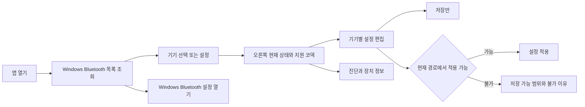

# UI/UX 상세 설계

상태: 화면·상호작용 설계와 [HTML 시안](ui/device-settings.html), Windows 앱 구현 전. **왼쪽 Bluetooth 기기 목록, 오른쪽 선택 기기의 상태와 설정**을 기본 구조로 사용합니다. 필드의 출처·단위·가용성은 [장치 상태 계약](device-status.md), 저장·적용은 [인터페이스](interfaces.md)를 따릅니다.

이미지는 HTML 시안을 1배율로 렌더링한 캡처입니다. 글자·버튼 크기는 CSS와 브라우저 실측값을 기준으로 합니다. 장치·상태·수치는 합성 예시이며 실제 지원·측정 결과가 아닙니다. [제작 기록](ui/generation.md)과 [시각·동작 검증](ui/design-qa.md)에 확인 범위를 남깁니다.

## 1. 제품의 중심 동작은 설정

사용자는 Windows에서 이미 페어링·연결한 Bluetooth 기기를 선택해 설정합니다. 기기 선택이나 **설정** 버튼은 오른쪽 편집 영역을 열 뿐 Bluetooth 연결을 시작하지 않습니다. 중심 action은 **설정 적용**, 보조 action은 **저장만 / 변경 취소**입니다.

- pairing, radio 켜기·끄기, 전역 Bluetooth 연결·해제는 Windows 설정에서 담당한다.
- 앱 창을 닫거나 설정 화면의 기기를 바꿔도 Windows 연결·현재 오디오·기본 출력 장치를 변경하지 않는다.
- Windows 연결 상태, 앱 stream 상태, 현재 codec과 설정 가용성을 구분한다.
- 원하는 값, 저장된 값, 적용 중인 값, 실제 현재 값을 구분한다.
- 조회 실패·미지원·미구현·권한 없음은 서로 다른 상태로 표시한다.
- 확인하지 못한 codec·품질·bitrate·해상도는 실제 값처럼 채우지 않는다.

## 2. 정보 구조와 화면 지도

| 화면 ID | 역할 | 기본 동작 |
| --- | --- | --- |
| UI-01 준비 상태 | 서비스·version·backend·provider 준비 여부 | 다시 확인, 준비 방법 보기 |
| UI-02 Bluetooth 목록 | Windows에 알려진 기기, 연결·종류·설정 가용성 | 기기 설정 열기, 검색·필터·새로 고침 |
| UI-03 기기 설정 | 현재 오디오 상태, 지원 코덱, 편집 form | 설정 적용, 저장만, 변경 취소 |
| UI-04 진단·장치 정보 | source와 측정 시각, 상세 format, 오류 | 다시 확인, 비식별 보고서 저장 |
| UI-05 앱 설정·트레이 | 테마·자동 실행·화면 열기 | 앱 설정 변경, 창 열기·닫기 |
| UI-06 복구 | 검증된 장치별 driver 복구 절차 | 영향 확인 후 별도 실행 |

`설정 / 진단 / 장치 정보`는 오른쪽 panel의 하위 탭입니다. 기기를 바꿔도 가능한 한 탭 위치를 보존합니다. 서비스가 없는 경우에도 전체 화면을 무한 spinner로 막지 않고 확인 가능한 Windows 목록과 준비 안내를 구분합니다.

## 3. 왼쪽 Bluetooth 기기 목록

목록은 Windows가 제공하는 현재 known/paired 장치입니다. **앱이 새 radio scan이나 pairing을 시작한 결과처럼 표현하지 않습니다.** 검색은 현재 목록의 이름을 필터링합니다. 미등록 기기는 **Windows Bluetooth 설정**으로 안내합니다.

| 요소 | 동작과 표시 |
| --- | --- |
| 기기 행 | 이름, 종류, Windows 연결 상태, 설정 가능 여부. 선택된 행은 배경·표식·접근성 selected 상태로 구분 |
| 설정 action | 기기 행 전체를 선택하면 오른쪽 설정 영역 열기. 행 안에 별도 설정 버튼을 중복 배치하지 않음 |
| 검색 | plain text 기기 이름 검색. 검색 결과 0건과 목록 조회 실패를 구분 |
| 필터 | 전체 장치 / 오디오 기기. 기본은 오디오 기기, 전체 목록에서 다른 종류도 확인 가능 |
| 비오디오 기기 | 이름·Windows 상태와 **오디오 설정 대상 아님**. codec form 비활성 |
| 새로 고침 | 목록·허용된 상태 조회. driver binding이나 profile 소유권 전환 없음 |
| Windows 설정 링크 | OS Bluetooth 설정 열기. 앱에서 자동 pairing·disconnect를 수행하지 않음 |

Bluetooth 주소·일련번호를 기본 목록에 노출하지 않습니다. 긴 이름은 행에서 생략할 수 있지만 접근성 이름과 상세에서 전체를 확인할 수 있게 합니다. 배터리·신호 세기는 검증된 provider가 생기기 전에는 표시하지 않습니다.

| 목록 상태 | UI 처리 |
| --- | --- |
| 최초 조회 중 | skeleton과 조회 중 안내. 예시 장치로 채우지 않음 |
| 등록된 장치 없음 | 빈 목록과 Windows 설정 열기 |
| 필터 결과 없음 | 검색·필터 초기화 |
| 조회 실패 | 오류·다시 확인. 기존 목록은 마지막 조회값임을 표시 |
| 페어링됨, 미연결 | 설정 보기·가능한 희망 설정 저장. 현재 적용은 불가 |
| Windows 연결됨 | 연결 사실만 표시. codec·stream이 확인된 것으로 간주하지 않음 |

다른 장치를 선택하는 행위는 **설정 대상 전환**입니다. 현재 오디오 출력 장치의 전환이 아닙니다. 편집 중인 draft가 있으면 **계속 편집 / 변경 버리기**를 확인하고 다른 장치에 값을 복사하지 않습니다.

## 4. 오른쪽 상단: 상태와 지원 코덱

선택 기기 이름 바로 아래에 **Windows 상태**와 **앱 오디오 상태**를 각각 표시합니다. 예: `Windows 연결됨` + `앱 오디오 전송 중`, 또는 `Windows 연결됨` + `현재 codec 확인 불가`.

상단에는 **지원 코덱  SBC · AAC · LDAC**처럼 읽기 전용 정보를 한 줄로 표시합니다. 코덱 이름을 버튼 모양의 badge로 만들지 않습니다. 별도의 앱 가용성 영역이나 준비 중 코덱 목록을 상단에 반복하지 않습니다. 내부의 가용성 구분은 다음 위치에서 표현합니다.

| 표시 | 내용 |
| --- | --- |
| 지원 코덱 | 상단 한 줄. 실제 peer capability 기준이며 unknown·이전 확인값은 명시 |
| 코덱 선택 목록 | 현재 조건에서 선택 가능한 항목만 활성화. 내부 backend·route·PCM 제약은 서비스가 검증 |
| 선택할 수 없는 이유 | 목록의 비활성 항목에 설명. 예: 이 버전에서는 설정할 수 없음, 현재 입력 형식과 맞지 않음, 현재 오디오 경로에서 변경할 수 없음 |

SBC·AAC·LDAC·aptX·aptX HD·aptX Low Latency는 프로젝트의 목표 identity입니다. 목표 전체 목록을 장치 지원 목록으로 채우지 않습니다. 지원 코덱 한 줄은 읽기 전용이며 실제 설정 변경은 아래 코덱 선택에서 수행합니다.

### 현재 오디오 상태

넓은 창에서는 읽기 전용 6열 요약을 한 줄로 표시하고, 1,100 DIP 이하에서는 3열×2행으로 배치합니다. label은 12 DIP, 값은 14 DIP이며 현재 상태를 큰 숫자 카드로 만들지 않습니다. 더 좁은 화면에서는 내용에 맞게 줄을 바꿉니다.

| 항목 | 표시 예 | 의미 |
| --- | --- | --- |
| 코덱 유형 | SBC | 현재 accept된 codec identity |
| 채널 모드 | Joint Stereo | 실제 codec coding mode, PCM channel count와 구분 |
| 샘플링 주파수 | 48 kHz | 현재 codec의 sampling frequency |
| 입력 PCM 해상도 | 16 bit PCM | encoder 입력의 valid bits와 sample kind |
| 전송률 | 328 kbps | 오디오 payload의 앱 측 완료 기준, 유효 시간 window의 평균 |
| 품질 설정 | 균형 / 자동·현재 표준 / 사용자 설정 | encoder active preset·mode, 청감 품질 점수 아님 |

위 값은 표시 형식의 예입니다. [상태 계약](device-status.md)에 정의한 source가 없으면 **확인 불가**, 대기 상태면 **재생 대기**, 늦은 값이면 **마지막 확인값**을 사용합니다. 상세 popover에서 provider·관찰 시각·유효성, PCM container bits, 목표 bitrate와 관측 bitrate를 구분합니다.

## 5. 기기별 설정과 적절한 선택지

설정에는 유효한 enum·범위·step만 제공합니다. 비활성 이유는 tooltip에만 숨기지 않고 form 설명과 접근성 description에 포함합니다.

| 그룹 | 항목 | 선택지와 조건 |
| --- | --- | --- |
| 코덱과 형식 | 선호 codec | 검증된 후보. 미지원 이름은 이유와 함께 확인 가능, 강제 적용 불가 |
| 코덱과 형식 | 스테레오 모드 | 자동 또는 codec-specific mode. SBC는 Mono / Dual Channel / Stereo / Joint Stereo의 실제 교집합 |
| 코덱과 형식 | 샘플링 주파수 | 자동 또는 local·peer·PCM 경로가 지원하는 Hz 값. 44.1/48/96 kHz를 모든 codec에 공통 제공하지 않음 |
| 코덱과 형식 | 입력 PCM 해상도 | local PCM/encoder가 함께 지원하는 sample format. 예: 16-bit PCM, 24-bit PCM, 32-bit float. 미구현 변환을 약속하지 않음 |
| 품질과 안정성 | 품질 preset | backend가 정의한 안정성 / 균형 / 음질 또는 codec 고유 mode. 실제 parameter 묶음으로 전개 |
| 품질과 안정성 | 목표 bitrate | encoder가 제공할 때만 자동/고정과 허용값. 현재 전송률과 별도 |
| 품질과 안정성 | 오디오 버퍼 | 자동(권장) 또는 검증된 pipeline profile. 지연 증가 가능성 안내 |
| 고급 설정 | codec 전용 parameter | 예: SBC bitpool. mode·sample rate 변경 후 범위와 frame 길이 재검증 |
| 호환 정책 | 공통 codec이 없으면 SBC 사용 | 명시적 opt-in. SBC 자체를 선택했으면 비활성·이유 표시 |

**스테레오 모드**는 일반적인 좌우 음량·공간 음향 설정이 아닙니다. 단일 coding mode만 가능하면 readonly로 표시합니다. SBC의 Joint Stereo를 다른 codec에 공통 옵션으로 넣지 않습니다. PCM mono/stereo channel count가 필요하면 codec mode와 별도 field로 검증합니다.

품질 preset 적용 후 사용자가 bitpool·bitrate를 바꾸면 **사용자 설정**으로 전환합니다. 자동 mode에서 고정값은 활성값으로 해석하지 않습니다. capability가 바뀌어 draft가 유효하지 않으면 무엇이 달라졌는지 설명하고 적용을 막습니다. ANC·EQ·마이크처럼 별도 device protocol이 필요한 기능은 제공하지 않습니다.

## 6. 저장과 적용

| 사용자 행동 | 동작 | 현재 오디오에 미치는 영향 |
| --- | --- | --- |
| 설정 열기·field 변경 | device별 draft 편집 | 없음 |
| 변경 취소 | draft 폐기 | 없음 |
| 저장만 | local schema/backend 검증 후 desired revision 저장. remote 미확인 값은 pending | 현재 active 유지 |
| 설정 적용 | 저장 후 해당 revision에 대한 ApplyPolicy | ProjectDriver가 소유한 경로에서만 설정·재구성. 필요 시 미리 알린 media 중단 |
| Windows 설정 열기 | OS 설정 화면 열기 | 앱에서 직접 pairing·연결·해제하지 않음 |
| 창 닫기·앱 종료 | 설정 클라이언트 종료 | stream과 Bluetooth 연결 유지. service 종료·driver 제거와 구분 |

저장 실패면 적용 요청을 보내지 않습니다. 저장 성공·적용 실패면 **설정은 저장했지만 적용하지 못했습니다**라고 표시하고 실제 active 값을 계속 확인합니다. WindowsDefault 또는 owner가 unknown이면 **현재 경로에서 적용할 수 없음**을 설명합니다. 사용자 모르게 driver를 바꾸거나 Windows 연결을 재생성하지 않습니다.

적용에 media 재시작이 필요하면 `기기 / 이전 → 요청 설정 / 오디오가 잠시 중단될 수 있음`을 보여줍니다. 단순 입력·저장에는 확인 dialog를 띄우지 않습니다. 성공은 적용된 revision·format의 service 응답으로 결정하며 UI animation으로 결정하지 않습니다.

stream이 없을 때 설정을 준비한 결과는 **다음 재생에 적용할 설정 준비됨**이며, 재생 중에 활성화한 결과와 구분합니다. OS audio client의 stream demand 없이 미디어 재생을 시작하지 않습니다.

## 7. loading·오류·상태 전이

| 관찰 상태 | UI | 허용 동작 |
| --- | --- | --- |
| 서비스 초기 조회 | 준비 상태 확인 중 | Windows 목록 보기, 유한 재시도 |
| backend 없음 | 이 빌드에는 오디오 전송 기능이 준비되지 않았습니다 | 문서·diagnostics, 실제 값 표시 없음 |
| Bluetooth 미연결 | Windows에서 연결한 뒤 현재 설정을 적용할 수 있습니다 | 설정 보기, 가능한 pending 저장, Windows 설정 열기 |
| WindowsDefault | 기본 Windows 경로, 확인 가능한 정보만 표시 | 설정 조회·pending 저장, 적용 불가 이유 |
| ProjectDriver Idle/Open | 재생 대기 / 다음 재생 설정 준비됨 | 유효한 설정 저장·준비 |
| Configuring | 설정 적용 중 | 같은 request의 진행 상태, 중복 적용 차단 |
| Streaming | 앱 오디오 전송 중 | 실제 상태 표시·설정 변경 |
| Suspended | 앱 오디오 일시 중지 | 실제 상태 확인, 과거 전송률을 현재 값으로 사용하지 않음 |
| Stopping | 앱 stream 정리 중 | 조회 가능, global disconnect로 표시하지 않음 |
| RecoveryRequired | 오디오 경로 복구 필요 | 검증된 복구 방법 보기 |
| provider 연결 상실 | 현재 오디오 상태 확인 불가 | 다시 확인, stale 표시, 제어 차단 |

클라이언트는 request ID·generation·format revision을 비교해 늦은 결과를 버립니다. 입력 오류는 해당 field에, 적용 오류는 저장/적용 영역에, provider 오류는 상태 영역에 표시합니다. 중요한 상태는 사라지는 toast에만 남기지 않습니다.

## 8. 진단·복구·앱 설정

진단은 현재 문제와 다음 행동을 먼저 제시합니다. detailed format·counter·관찰 provenance는 펼쳐서 확인합니다. 보고서는 preview 후 사용자가 고른 로컬 파일로만 저장하고, 원시 오디오·주소·일련번호·dump는 기본에서 제외합니다.

복구는 설정 적용과 분리합니다. 선택한 device의 driver binding과 현재 오디오에 미치는 영향, 관리자 권한이 필요한 시점을 보여줍니다. 구현·검증된 복구 기능만 노출하고 실제 기본 오디오 복귀 확인 전에는 성공으로 표시하지 않습니다. TESTSIGNING·Secure Boot를 일반 사용자 자동 해결책에 포함하지 않습니다.

앱 설정의 초기값은 시스템 theme, 자동 실행 꺼짐입니다. 트레이는 앱 열기, 현재 상태 요약, 앱 종료를 제공합니다. **앱 종료는 설정 UI만 종료하며 재생 중인 audio와 Windows 연결을 유지합니다.** service lifecycle은 Windows audio endpoint의 demand와 PnP·전원 events가 소유합니다.

## 9. 폰트·밀도·색상

| 항목 | 기본 설계값 | 목적 |
| --- | --- | --- |
| font family | Windows의 Segoe UI Variable Text / Segoe UI, 한글은 설치된 맑은 고딕 fallback | OS와 일관된 문자, 별도 font download·재배포 없음 |
| 본문·control | 14 DIP, regular 400 | 제목·label·버튼을 모두 굵게 강조하지 않음 |
| caption | 12 DIP, 지원 코덱 한 줄은 13 DIP | 보조 정보의 명확한 위계 |
| 기기 제목 | 20 DIP, line height 28 DIP, semibold | 선택 기기만 절제하여 강조 |
| 현재 상태 숫자 | 14 DIP, semibold, tabular digits | 본문과 같은 크기, 값 변경 시 폭 흔들림 최소화 |
| 입력·버튼·segmented 높이 | 32 DIP, border 1 DIP, radius 4 DIP | 모든 control의 외곽 치수 통일 |
| 하단 동작 버튼 | 각각 96×32 DIP, font 14 DIP, 사이 8 DIP | 취소·저장·적용은 같은 컴포넌트의 역할 변형 |
| 간격 | form 행 48 DIP, 열 사이 28 DIP, 본문 padding 28 DIP | 동일한 정렬축·행 간격 |
| 목록 / 본문 / 입력 surface | `#1B2024` / `#20262B` / `#282F35` | 평평한 중성 surface, glow·gradient 없음 |
| 본문 / 보조 text | `#EEF2F4` / `#B4BEC5` | 상태·설명 가독성 |
| accent | `#A0E8CD`, 버튼 text `#10231B` | 설정 적용과 선택 상태 |
| focus | 2 DIP 이상의 명확한 focus ring | keyboard 위치 확인 |

지정한 sRGB token을 상대 휘도로 계산하면 입력 surface 위 본문은 약 12.04:1, 보조 text는 7.18:1, accent 버튼 text는 11.67:1입니다. 이는 정상 색상 쌍의 계산이며 disabled·focus·고대비 렌더링 검증을 대신하지 않습니다.

시안 검증 크기는 1,280×880 및 760×640 CSS px, device scale factor 1입니다. 기본 목록은 224 DIP, 좁은 창은 200 DIP입니다. 1,100 DIP 이하에서 2열 form을 1열로 바꾸고 본문을 스크롤합니다. 저장·적용 영역은 본문과 겹치지 않는 별도 하단 행입니다. 하단은 **변경 취소 / 저장만 / 설정 적용** 순서이며 변경이 없으면 비활성화합니다. 저장한 값이 현재 값과 다르면 설정 적용만 활성화할 수 있습니다. 200% text의 실제 검증은 후속 Windows UI에서 수행하며 공간이 부족하면 footer를 일반 흐름으로 전환합니다.

시스템 밝은 theme·고대비는 semantic token으로 대응하며 고정 RGB를 강제하지 않습니다. 선택·오류·연결 상태는 색상 외 text·icon·accessible state를 함께 사용합니다. 과한 gradient·glow·입체효과와 장식 animation은 넣지 않습니다.

## 10. 키보드·접근성

- Tab: 목록 검색·filter → 기기 list → 설정/진단 탭 → form → 설정 적용·저장만·취소. list/radio group 내부는 방향키.
- Enter/Space는 focus된 control만 실행한다. Escape는 dialog·draft 취소에 쓰며 Bluetooth 해제나 오디오 중단을 실행하지 않는다.
- Ctrl+,는 앱 설정, F5는 현재 목록·상태 조회. 비활성 설정을 단축키로 우회하지 않는다.
- 이름·role·value·readonly·불가 이유를 UI Automation에 노출한다. 상태 갱신으로 focus를 이동하지 않는다.
- 측정 전송률의 매초 변화는 screen reader로 반복 낭독하지 않는다. codec 변경·적용 완료·오류만 필요한 알림을 제공한다.
- 정상 text 대비 4.5:1, 큰 text 3:1 이상을 목표로 실제 구현에서 확인한다. 고대비, DPI 100/125/150/200%, text 200%, keyboard·Narrator 사용을 검증한다.

공식 기준: [접근성](https://learn.microsoft.com/en-us/windows/apps/develop/accessibility), [점검표](https://learn.microsoft.com/en-us/windows/apps/design/accessibility/accessibility-checklist), [keyboard](https://learn.microsoft.com/en-us/windows/apps/develop/input/keyboard-interactions).

## 11. UI 수용 기준

| ID | 상황 | 기대 결과 |
| --- | --- | --- |
| UX-01 | 이미 Windows에서 연결한 기기 선택 | 설정 panel 표시, pairing/connect/disconnect 호출 없음 |
| UX-02 | Bluetooth 목록·검색·전체/오디오 filter | 오디오 대상 구분, 비오디오 기기 codec 설정 불가 |
| UX-03 | peer capability unknown·stale·known | 지원 codec 구분, unknown을 미지원으로 치환하지 않음 |
| UX-04 | 장치 지원 codec과 앱 backend 불일치 | 장치 지원과 사용 가능 목록을 구분, 불가 이유 표시 |
| UX-05 | ProjectDriver가 실제 오디오 전송 | 6개 상태값과 source·단위가 일관된 snapshot에서 표시 |
| UX-06 | WindowsDefault에 검증된 codec provider 없음 | 확인 불가 표시, PCM 정보를 codec 정보로 대체하지 않음 |
| UX-07 | 24 valid bits / 32 container, float | 유효 해상도·container·sample kind를 혼동하지 않음 |
| UX-08 | bitrate 목표·실측·첫 window·counter reset | 서로 다른 항목, 무효 측정은 0이나 목표값으로 채우지 않음 |
| UX-09 | SBC/LDAC/AAC 전환·stereo mode 변경 | codec별 교집합만 선택, Joint Stereo를 보편 옵션으로 쓰지 않음 |
| UX-10 | preset 수동 변경·자동 bitrate | custom 상태와 유효한 활성값, 숨은 field 우회 불가 |
| UX-11 | 저장 성공·적용 실패 | desired와 active 분리, 명확한 부분 성공 문안 |
| UX-12 | 경로 소유권·capability·generation 변경 | stale 적용 거부, draft 보존, binding 자동 변경 없음 |
| UX-13 | 기기 선택 변경·UI 닫기·종료 | 다른 device 설정·Windows 연결·현재 오디오 유지 |
| UX-14 | keyboard·Narrator·고대비·200% text | 상태·불가 이유·모든 핵심 설정 접근 가능, 가림 없음 |
| UX-15 | 실측 갱신 지연 3초 초과 | stale 표시, 과거값을 live 값으로 유지하지 않음 |
| UX-16 | 진단 저장·복구 실패 | 비식별 local export, 실제 복구 확인 전 성공 표시 없음 |
| UX-17 | 기본 크기·좁은 창·편집 전후 | 14/20 DIP 글꼴 위계, 32 DIP control 높이, 동일 하단 버튼, 선택 가능 이유의 일관된 위치, 가로 잘림 없음 |

HTML 시안의 검색·기기 전환·탭·편집/저장/적용과 기본 키보드 동작은 브라우저에서 확인합니다. 브라우저 메모리의 예시 상태만 바꾸며 장치·네트워크·저장소·서비스에 접근하지 않습니다. Windows 앱의 UI Automation·Narrator·OS text scaling·실기 telemetry는 후속 구현에서 검증합니다. 앞선 설계 리뷰의 D1~D7은 이 시안의 화면 모의 동작으로 해결되었다고 판단하지 않습니다.
